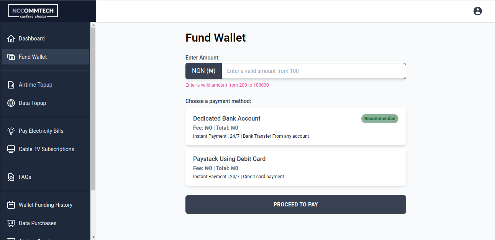

# Data Reseller Website

A fullstack application for purchasing airtime and mobile data from major Nigerian network providers, also supports Electricity and Cabletv bill payment as well as user authentication, Google OAuth, Online payment using Paystack, Email Services and many others.

## Demo
Here is a working live demo: [https://data-reseller-website-jmog.vercel.app/](https://data-reseller-website-jmog.vercel.app/)

## Screenshots
**Dashboard**

**Payment**

## Built With
* [Next.js](https://nextjs.org/): The frontend of the application is built with Next.js and utilizes Next.js powerful features like static generation.
* [Tailwind CSS](https://tailwindcss.com/): The Next.js frontend application utilizes Tailwind CSS for creating higly customizable and mobile responsive web pages.
* [TypeScript](https://www.typescriptlang.org/): The Next.js frontend application utilizes Typescript for improving developer experience through editor intelliSence, auto-completion and many other features.
* [Strapi CMS](https://strapi.io/): Powers the backend of the application and speeds up bootstraping a highly customizable node.js application.
* [MongoDB](https://www.mongodb.com/): The Strapi application utilizes a MongoDB database for storing data.
* [Paystack](https://paystack.com/): Powers online payment in the application.